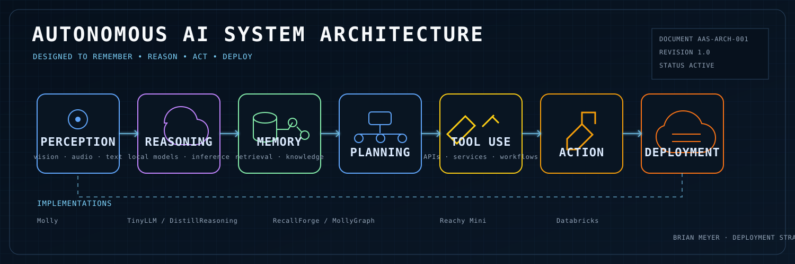

  

<h1 align="center">Brian Meyer</h1>

  <strong>Building production AI systems that remember, reason, and act.</strong> 
  Deployment Strategist @ Databricks

  <strong>Useful &gt; Novel</strong> &nbsp;·&nbsp;
  <strong>Working &gt; Clever</strong> &nbsp;·&nbsp;
  <strong>Shipping &gt; Talking</strong>

---

## Mission

I build and explore the systems around modern AI: how models gain memory, use tools, run locally, interact with people, and move from prototypes into dependable real-world deployments.

My work sits at the intersection of AI product strategy, systems design, experimentation, and deployment.

## Capability Map

<table>
  <tr>
    <td width="50%" valign="top">
      <h3>Agent Systems</h3>
      
<a href="https://github.com/brianmeyer/molly"><strong>Molly</strong></a>

      
A personal AI assistant and experimentation platform for agent workflows, tool use, orchestration, and practical automation.

    </td>
    <td width="50%" valign="top">
      <h3>Memory &amp; Knowledge</h3>
      
<a href="https://github.com/brianmeyer/recallforge"><strong>RecallForge</strong></a> / <a href="https://github.com/brianmeyer/mollygraph"><strong>MollyGraph</strong></a>

      
Persistent memory, retrieval, semantic relationships, knowledge graphs, and long-term context for AI systems.

    </td>
  </tr>
  <tr>
    <td width="50%" valign="top">
      <h3>Local AI</h3>
      
<a href="https://github.com/brianmeyer/tinyllm"><strong>TinyLLM</strong></a> / <a href="https://github.com/brianmeyer/distillreasoning"><strong>DistillReasoning</strong></a>

      
Local model experimentation across inference, reasoning workflows, serving, distillation, and deployable LLM systems.

    </td>
    <td width="50%" valign="top">
      <h3>Embodied AI</h3>
      
<a href="https://github.com/brianmeyer/reachy_mini_conversation_app"><strong>Reachy Mini Conversation App</strong></a>

      
Voice-first robotics, multimodal interaction, and experiments in bringing AI systems into the physical world.

    </td>
  </tr>
</table>

## Current Focus

- Better agent memory
- Local-first AI systems
- Multi-agent architectures
- Robotics and multimodal interfaces
- Production deployment patterns
- Human-AI collaboration

## Design Principles

<table>
  <tr>
    <td>Build for production.</td>
    <td>Prefer useful systems over impressive demos.</td>
  </tr>
  <tr>
    <td>Use local-first architectures when practical.</td>
    <td>Keep humans in the loop where judgment matters.</td>
  </tr>
  <tr>
    <td>Prefer simple, maintainable systems.</td>
    <td>Measure before optimizing.</td>
  </tr>
</table>

## About

- Deployment Strategist at Databricks
- Kellogg School of Management MBA
- U.S. Navy veteran
- Builder exploring production AI systems

---

  <strong>Useful &gt; Novel · Working &gt; Clever · Shipping &gt; Talking</strong>

